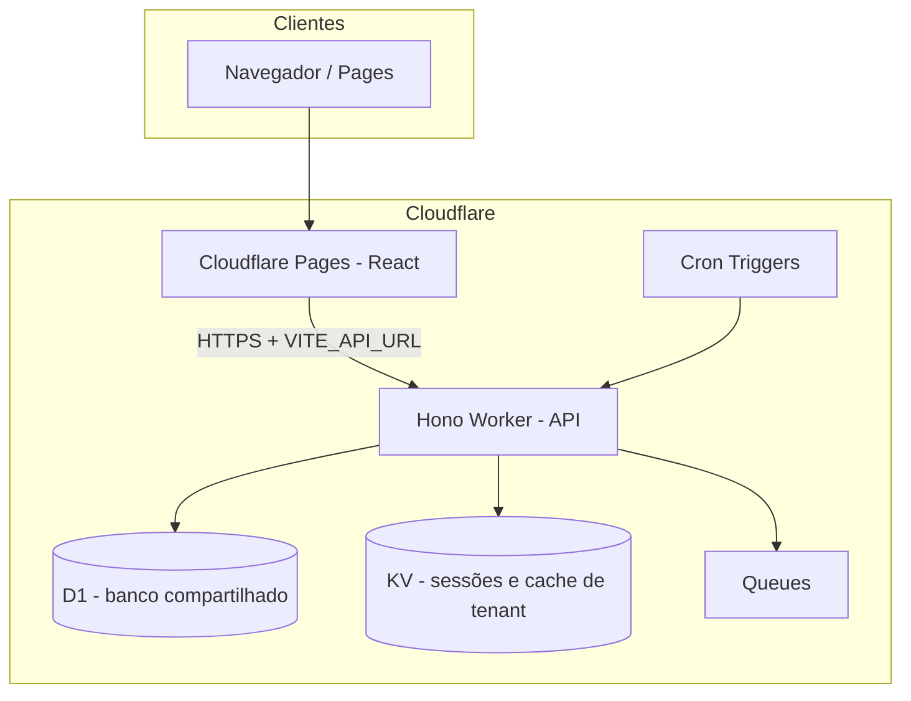

# SISCR — ERP SaaS multi-tenant (Cloudflare)

Monorepo **100% serverless** na Cloudflare: **Workers** (API), **Pages** (frontend), **D1** (SQLite), **KV**, **Queues** e **Cron**. Não há stack local com Docker nem servidor Node “de longa duração”: desenvolvimento usa Wrangler + Vite apontando para D1 local ou remoto.

**Branch de staging / integração contínua:** `cloudflare`

---

## Acesso ao ambiente de staging

| Camada | URL |
|--------|-----|
| **Frontend (Cloudflare Pages)** | [https://staging.siscr-web.pages.dev/](https://staging.siscr-web.pages.dev/) |
| **API (Cloudflare Worker)** | `https://siscr-api-staging.lucaspercisi.workers.dev` |

O build de produção do frontend é feito com `VITE_API_URL` apontando para essa API (ver `.github/workflows/deploy-staging.yml`).

---

## Stack

| Camada | Tecnologia |
|--------|------------|
| Frontend | React 19 + TypeScript + Vite + Tailwind CSS → **Cloudflare Pages** |
| Backend | **Hono** (TypeScript) → **Cloudflare Workers** |
| Banco de dados | **Cloudflare D1** (SQLite) — **um banco compartilhado** por ambiente, isolamento **lógico** por `tenant_id` |
| Cache / sessões | **Cloudflare KV** |
| Arquivos / XMLs | **Cloudflare R2** (opcional conforme `wrangler.toml`) |
| Tarefas assíncronas | **Cloudflare Queues** |
| Agendamento | **Cloudflare Cron Triggers** |
| ORM | **Drizzle ORM** |
| Pagamentos | **Stripe** |
| Monorepo | **Turborepo + pnpm** |

---

## Arquitetura atual (visão geral)



### Banco compartilhado (D1)

- Existe **um** database D1 por “faixa” de ambiente (ex.: `siscr-shared-staging` no staging), configurado em `apps/api/wrangler.toml`.
- **Todos os tenants** convivem no **mesmo** arquivo SQLite lógico; o isolamento é feito por **colunas de escopo** (em geral `tenant_id` nas tabelas de negócio) e por middleware que resolve o tenant atual (header `X-Tenant-Slug` em dev, subdomínio em produção).
- **Migrações** ficam em `packages/db/migrations/shared/` e são aplicadas com Wrangler (`--local` para SQLite em disco no dev, `--remote` para o D1 na Cloudflare).
- Vantagens: um único pipeline de migração, backup/snapshot por database, custo previsível. A responsabilidade de **nunca misturar dados entre tenants** está nas queries e no middleware da API.

### Outros serviços

- **KV:** sessões de autenticação e cache de roteamento de tenant.
- **Queues:** trabalhos assíncronos (e-mails, relatórios, etc.).
- **Cron:** rotinas agendadas disparadas no Worker.

---

## Estrutura do projeto

```
siscr/
├── apps/
│   ├── web/                 # Frontend React → Cloudflare Pages
│   └── api/                 # Backend Hono → Cloudflare Workers
│       ├── src/
│       │   ├── index.ts
│       │   ├── lib/         # Ex.: matriz de permissões por módulo
│       │   ├── middleware/  # tenant, auth, guards de módulo
│       │   └── routes/      # auth, tenants, cadastros, estoque, financeiro, faturamento, vendas, permissoes, stripe, ...
│       └── wrangler.toml    # D1, KV, Queues, env staging/production
├── packages/
│   ├── db/
│   │   ├── src/schema/      # Schema Drizzle
│   │   └── migrations/shared/   # SQL aplicado no D1 compartilhado
│   └── shared/
│       └── src/types/
├── .github/workflows/
│   ├── deploy-staging.yml       # Push em `cloudflare` → migrate D1 + Worker + Pages
│   └── deploy-production.yml    # Deploy produção (tags / fluxo definido no repo)
├── turbo.json
├── pnpm-workspace.yaml
└── package.json
```

---

## Multi-tenant (resumo)

```
Tenant (grupo empresa)
  └── Mesmo D1 compartilhado (cada linha de negócio com tenant_id)
        ├── Empresa A …
        └── Empresa B …
```

- **Desenvolvimento:** header `X-Tenant-Slug: meugrupo`
- **Produção (planejado):** subdomínio `meugrupo.seudominio.com.br` (ajustar DNS e `ALLOWED_ORIGINS` / `FRONTEND_URL` no Worker)

---

## Pré-requisitos

- [Node.js 20+](https://nodejs.org/)
- [pnpm 9+](https://pnpm.io/installation)
- [Wrangler CLI](https://developers.cloudflare.com/workers/wrangler/install-and-update/) (via `pnpm` no projeto ou global)
- Conta Cloudflare

---

## Configuração inicial (primeira vez na máquina)

### 1. Instalar dependências

```bash
pnpm install
```

### 2. Autenticar no Cloudflare

```bash
cd apps/api
npx wrangler login
```

### 3. Recursos na Cloudflare (staging)

Se ainda não existirem no seu account, crie D1, KV, fila, etc., e preencha os IDs em `apps/api/wrangler.toml`. O repositório de referência já contém IDs de staging; para um fork novo, use comandos como:

```bash
npx wrangler d1 create siscr-shared-staging
npx wrangler kv namespace create KV_SESSIONS
npx wrangler kv namespace create KV_TENANT_CACHE
npx wrangler queues create siscr-tasks-staging
```

(R2 e outros itens seguem o que estiver ativo no `wrangler.toml`.)

### 4. Migrações do D1

```bash
# Banco local (SQLite em .wrangler/state) — desenvolvimento
pnpm --filter=@siscr/api run db:migrate:shared

# Banco remoto na Cloudflare (staging)
pnpm --filter=@siscr/api run db:migrate:shared:remote
# equivalente a: wrangler d1 migrations apply siscr-shared-staging --remote
```

### 5. Secrets do Worker (staging)

```bash
cd apps/api
npx wrangler secret put BETTER_AUTH_SECRET --env staging
npx wrangler secret put STRIPE_SECRET_KEY --env staging
npx wrangler secret put STRIPE_WEBHOOK_SECRET --env staging
```

### 6. Desenvolvimento local

```bash
# Terminal 1 — API (Worker + D1 local)
pnpm dev:api
# http://localhost:8787

# Terminal 2 — frontend
pnpm dev:web
# http://localhost:5173
```

Configure `VITE_API_URL` no `.env` do `apps/web` se precisar apontar para a API de staging em vez de `localhost`.

---

## Deploy de staging

Push na branch **`cloudflare`** dispara o workflow que:

1. Aplica migrações no D1 remoto `siscr-shared-staging`
2. Faz deploy do Worker (`wrangler deploy --env staging`)
3. Builda o frontend com a URL da API de staging
4. Publica o `dist` no projeto Cloudflare Pages **siscr-web** (branch `staging`)

**URLs após o pipeline:**

- Frontend: **https://staging.siscr-web.pages.dev/**
- API: **https://siscr-api-staging.lucaspercisi.workers.dev**

---

## Secrets no GitHub Actions

`Settings → Secrets and variables → Actions`

| Secret | Uso |
|--------|-----|
| `CLOUDFLARE_API_TOKEN` | Token com permissão para Workers, D1 e Pages |
| `CLOUDFLARE_ACCOUNT_ID` | ID da conta Cloudflare |

---

## Testar multi-tenant localmente

```bash
curl http://localhost:8787/api/health

curl -X POST http://localhost:8787/api/auth/login \
  -H "Content-Type: application/json" \
  -d '{"email":"admin@teste.com","password":"senha123","tenantSlug":"meugrupo"}'

curl http://localhost:8787/api/tenant/cadastros/pessoas \
  -H "X-Tenant-Slug: meugrupo" \
  -H "Authorization: Bearer SEU_TOKEN"
```

---

## Endpoints da API (resumo)

### Públicos

| Método | Rota | Descrição |
|--------|------|-----------|
| GET | `/api/health` | Health check |
| POST | `/api/auth/login` | Login |
| POST | `/api/auth/signup` | Criar conta |
| POST | `/api/auth/logout` | Logout |
| GET | `/api/auth/me` | Sessão / usuário atual |
| GET | `/api/subscriptions/plans` | Planos |
| POST | `/api/webhooks/stripe` | Webhook Stripe |

### Autenticados (`Authorization` + `X-Tenant-Slug` onde aplicável)

Incluem rotas em `/api/tenant/...` para cadastros, estoque, financeiro, faturamento, vendas, configurações de tenant, **perfis de permissão personalizados** (`/api/tenant/permissoes/...`), etc. Rotas mutáveis podem exigir permissão de **edição** por módulo (ver código em `apps/api/src/middleware/moduleGuard.ts`).

---

## Custos (ordem de grandeza, Cloudflare)

| Cenário | Custo típico |
|---------|----------------|
| Dev / staging moderado | Freemium / baixo |
| Produção pequena | Consulte [preços Cloudflare](https://www.cloudflare.com/plans/) (Workers, D1, Pages) |

---

## Legado (Docker e scripts antigos)

Versões anteriores do projeto podem ter usado **Docker Compose**, scripts shell e banco **por container**. **O fluxo atual é só Cloudflare + pnpm + Wrangler**: não há `docker-compose` nem serviço de API persistente fora do Worker. Use sempre os comandos deste README e o `wrangler.toml` como fonte da verdade para nomes de D1 e bindings.
