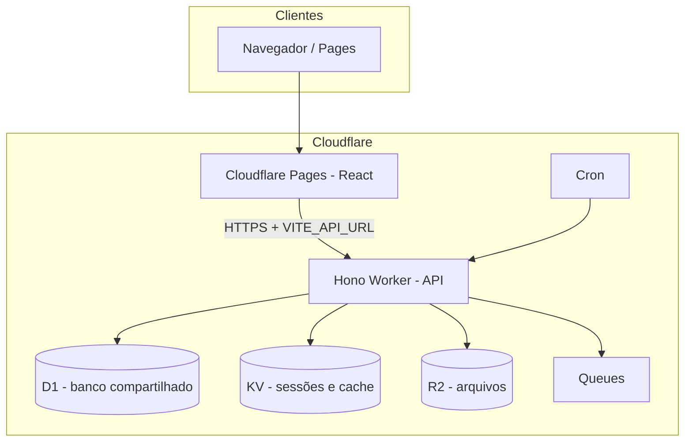

# SISCR — ERP SaaS multi-tenant (Cloudflare)

Monorepo **100% serverless** na Cloudflare: **Workers** (API), **Pages** (frontend), **D1** (SQLite), **KV**, **Queues**, **Cron** e **R2**. Não há stack com Docker nem servidor Node de longa duração: desenvolvimento usa **Wrangler** + **Vite** (D1 local ou remoto).

**Branch de staging / CI:** `cloudflare`

**Documentação adicional:** pasta **[`doc/`](./doc/README.md)** (tenant/URLs/domínios, checklist para **nova conta Cloudflare**).

---

## Acesso ao ambiente de staging (referência do repositório)

| Camada | URL (exemplo — ajuste após fork / nova conta) |
|--------|-----------------------------------------------|
| **Frontend (Cloudflare Pages)** | `https://staging.siscr-web.pages.dev/` |
| **API (Cloudflare Worker)** | `https://siscr-api-staging.<subdomain>.workers.dev` |

O build do frontend usa **`VITE_API_URL`** apontando para a URL pública do Worker (ver `.github/workflows/deploy-staging.yml`). Após migrar para outra conta, atualize o workflow e as variáveis do Pages.

---

## Stack

| Camada | Tecnologia |
|--------|------------|
| Frontend | React 19 + TypeScript + Vite + Tailwind → **Cloudflare Pages** |
| Backend | **Hono** (TypeScript) → **Cloudflare Workers** |
| Banco | **Cloudflare D1** (SQLite) — **um banco compartilhado** por ambiente, isolamento lógico por `tenant_id` |
| Cache / sessões | **Cloudflare KV** |
| Arquivos (NF-e, certificado A1) | **Cloudflare R2** |
| Filas | **Cloudflare Queues** |
| Agendamento | **Cron Triggers** (no Worker) |
| ORM | **Drizzle ORM** |
| Pagamentos | **Stripe** |
| Monorepo | **Turborepo + pnpm** |

---

## Arquitetura (visão geral)



### Banco compartilhado (D1)

- Um database D1 por faixa de ambiente (ex.: `siscr-shared-staging`), em `apps/api/wrangler.toml`.
- Todos os tenants no mesmo SQLite lógico; isolamento por `tenant_id` e middleware de API.
- Migrações: `packages/db/migrations/shared/` — aplicar com Wrangler (`--local` / `--remote`).

---

## Multi-tenant — como o sistema sabe o tenant

1. **Header `X-Tenant-Slug`** — enviado pelo cliente HTTP após login (`localStorage`).
2. **Sessão Bearer** — se o header não vier, o Worker infere pelo token (KV).
3. **Subdomínio (opcional)** — se **`TENANT_HOST_BASE`** estiver definido no Worker (ex.: `app.suaempresa.com.br`), requisições a `https://{slug}.app.suaempresa.com.br` resolvem o tenant pelo host.

**Staging em `*.pages.dev`:** normalmente **um único host**; a URL pode incluir **`/app?tenant=<slug>`** após login. Subdomínio real exige **domínio próprio + DNS wildcard** — ver [`doc/tenant-e-dominios.md`](./doc/tenant-e-dominios.md).

---

## Estrutura do projeto

```
siscr/
├── apps/
│   ├── web/                 # Frontend React → Cloudflare Pages
│   ├── support/             # Mesa de suporte (time interno) → Pages
│   └── api/                 # Backend Hono → Workers
│       ├── src/
│       │   ├── index.ts     # CORS, rotas públicas, montagem
│       │   ├── middleware/  # tenant, auth, módulos
│       │   └── routes/      # auth, subscriptions, tenant/*, webhooks, publicLookup, …
│       └── wrangler.toml
├── packages/
│   └── db/migrations/shared/
├── doc/                     # Documentação complementar (tenant/URL, nova conta CF)
├── .github/workflows/
│   └── deploy-staging.yml   # Push em `cloudflare` → D1 migrate + Worker + Pages
├── turbo.json
├── pnpm-workspace.yaml
└── package.json
```

---

## Variáveis de ambiente relevantes

### Worker (`apps/api/wrangler.toml` — `[vars]` / `[env.*.vars]`)

| Variável | Função |
|----------|--------|
| `ENVIRONMENT` | Nome lógico do ambiente |
| `APP_URL` | URL pública da API |
| `FRONTEND_URL` | URL do SPA (Stripe success/cancel, etc.) |
| `ALLOWED_ORIGINS` | Origens CORS (lista separada por vírgula); com `TENANT_HOST_BASE`, subdomínios compatíveis são aceitos dinamicamente |
| `NFE_DEV_MODE` | `"1"` desenvolvimento NF-e; `"0"` produção |
| `TENANT_HOST_BASE` | *(Opcional)* Host “pai” para tenant por subdomínio (ex.: `app.suaempresa.com.br`) |

**Secrets** (não versionados; `wrangler secret put`): `BETTER_AUTH_SECRET`, `STRIPE_SECRET_KEY`, `STRIPE_WEBHOOK_SECRET`, `STRIPE_PRICE_BASICO` / `PRO` / `ENTERPRISE`, `CERT_BLOB_SECRET` — lista em [`doc/cloudflare-nova-conta-e-dependencias.md`](./doc/cloudflare-nova-conta-e-dependencias.md). Cobrança e produção Stripe: [`doc/billing-stripe.md`](./doc/billing-stripe.md).

### Frontend (build Vite / Pages)

| Variável | Função |
|----------|--------|
| `VITE_API_URL` | URL base da API (**obrigatória** no build de staging/produção) |
| `VITE_TENANT_HOST_BASE` | *(Opcional)* Alinhado com `TENANT_HOST_BASE` para hostname por tenant |
| `VITE_TENANT_URL_TEMPLATE` | *(Opcional)* Preview no cadastro (`{slug}`) |

---

## Endpoints públicos da API (resumo)

| Método | Rota | Descrição |
|--------|------|-----------|
| GET | `/api/health` | Health check |
| POST | `/api/auth/login` | Login |
| POST | `/api/auth/signup` | Cadastro (slug de tenant opcional; validação de disponibilidade) |
| GET | `/api/auth/tenant-slug/availability` | Disponibilidade de subdomínio/slug |
| GET | `/api/auth/session-status` | Pós-Stripe / tenant criado |
| POST | `/api/auth/logout` | Logout |
| GET | `/api/auth/me` | Sessão atual |
| GET | `/api/subscriptions/plans` | Planos |
| POST | `/api/subscriptions/checkout` | Checkout Stripe (novo tenant pago) |
| GET | `/api/public/cep/:cep` | Proxy ViaCEP (JSON) |
| GET | `/api/public/cnae/:codigo` | Proxy IBGE CNAE (7 dígitos) |
| POST | `/api/webhooks/stripe` | Webhook Stripe |

Rotas **`/api/tenant/*`** exigem autenticação e resolução de tenant (header/sessão/subdomínio conforme middleware).

---

## Pré-requisitos

- [Node.js 20+](https://nodejs.org/)
- [pnpm 9+](https://pnpm.io/installation)
- [Wrangler](https://developers.cloudflare.com/workers/wrangler/install-and-update/)
- Conta Cloudflare

---

## Configuração local (primeira vez)

### 1. Dependências

```bash
pnpm install
```

### 2. Cloudflare (Wrangler)

```bash
cd apps/api
npx wrangler login
```

### 3. Recursos na Cloudflare

Para uma **nova conta** ou fork, crie D1, KV, R2, fila e atualize **IDs e nomes** em `apps/api/wrangler.toml`. Passo a passo detalhado: [`doc/cloudflare-nova-conta-e-dependencias.md`](./doc/cloudflare-nova-conta-e-dependencias.md).

### 4. Migrações D1

```bash
pnpm --filter=@siscr/api run db:migrate:shared
pnpm --filter=@siscr/api run db:migrate:shared:remote   # remoto — requer wrangler configurado
```

### 5. Secrets do Worker

```bash
cd apps/api
npx wrangler secret put BETTER_AUTH_SECRET --env staging
npx wrangler secret put STRIPE_SECRET_KEY --env staging
npx wrangler secret put STRIPE_WEBHOOK_SECRET --env staging
# Price IDs Stripe, CERT_BLOB_SECRET, etc. — ver wrangler.toml e doc/
```

### 6. Dev: API + Web

```bash
pnpm dev:api    # http://localhost:8787
pnpm dev:web    # http://localhost:5173
```

`apps/web/.env`: `VITE_API_URL=http://localhost:8787` (ou URL da API remota).

---

## Deploy de staging

**Push na branch `cloudflare`** dispara `.github/workflows/deploy-staging.yml`:

1. `d1 migrations apply` no banco remoto de staging  
2. `wrangler deploy --env staging`  
3. Build do web com `VITE_API_URL` fixada no workflow  
4. `wrangler pages deploy` no projeto Pages configurado  

Atualize **URLs do Worker**, **nome do projeto Pages** e **IDs** ao usar outra conta Cloudflare.

### Secrets no GitHub Actions

`Settings → Secrets → Actions`

| Secret | Uso |
|--------|-----|
| `CLOUDFLARE_API_TOKEN` | Workers, D1, Pages (escopos conforme política da conta) |
| `CLOUDFLARE_ACCOUNT_ID` | ID da conta |

---

## Testar multi-tenant localmente

```bash
curl http://localhost:8787/api/health

curl -X POST http://localhost:8787/api/auth/login \
  -H "Content-Type: application/json" \
  -d '{"email":"admin@teste.com","password":"senha123","tenantSlug":"meugrupo"}'

curl http://localhost:8787/api/tenant/cadastros/pessoas \
  -H "X-Tenant-Slug: meugrupo" \
  -H "Authorization: Bearer SEU_TOKEN"
```

---

## Custos

Ordem de grandeza: plano gratuito / pago Cloudflare (Workers, D1, Pages, R2) — ver [preços](https://www.cloudflare.com/plans/).

---

## Legado

Fluxos antigos com Docker Compose ou API fora do Worker **não** são o caminho atual. Fonte da verdade para infra: **`wrangler.toml`**, **`doc/`** e este README.

---

## Documentação do frontend

Ver [`apps/web/README.md`](./apps/web/README.md) e [`doc/`](./doc/README.md).
